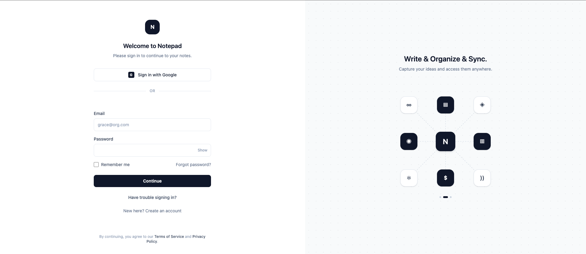
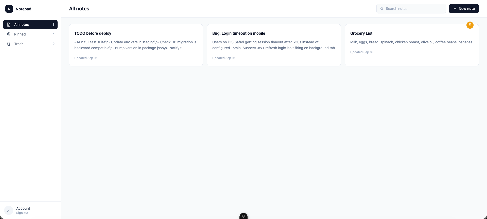
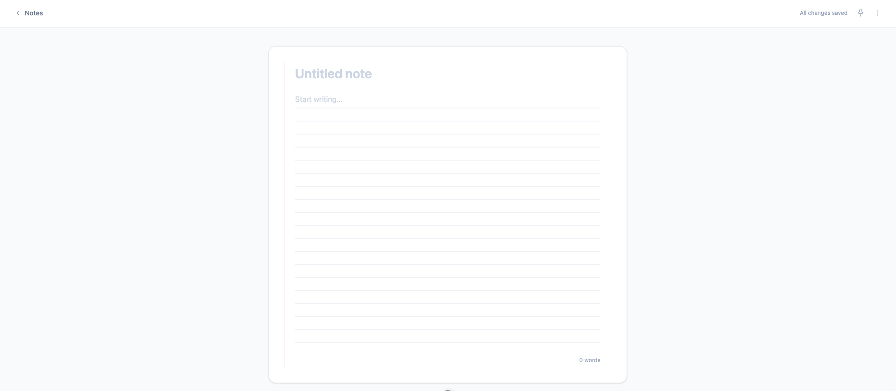

# Notepad

A personal notepad app — write, pin, search, and trash notes.

## Tech Stack

- **Database:** PostgreSQL
- **Backend:** ASP.NET Core (C#)
- **Frontend:** Vue 3 + TypeScript + Tailwind CSS
- **Deployment:** Docker Compose

## Quick Start (Docker Compose)

1. Copy the example config and fill in real values:

   ```bash
   cp env/.env.example env/.env
   cp env/sample-appsettings.json env/appsettings.json
   ```

   - `env/.env` — Postgres credentials and the frontend's API base URL.
   - `env/appsettings.json` — the backend's DB connection string, JWT secret, and CORS allowed origins. Leave `Host=postgres` as-is — that's the Docker Compose service name, not a placeholder to replace.

2. Build and start everything:

   ```bash
   docker compose --env-file env/.env up -d --build
   ```

   This starts three containers: `postgres`, `notepad-backend` (http://localhost:8080), and `notepad-frontend` (http://localhost:5173).

3. Create the database role, schema, and tables — one-time, after Postgres is up and healthy:

   ```bash
   docker compose exec -T postgres psql -U notepad -d notepad < schema/GenerateDBUser.sql
   docker compose exec -T postgres psql -U notepad -d notepad < schema/CreateTables.sql
   ```

   Run them in this order: `GenerateDBUser.sql` creates the `notepad_app` role and `dbo` schema that `CreateTables.sql` depends on. Swap `notepad`/`notepad` above for your own `POSTGRES_USER`/`POSTGRES_DB` if you changed them in `env/.env`.

4. Completed

## Demo Screenshot








